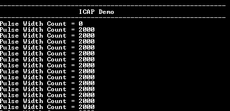

# ICAP capture mode

This example application shows how to use the ICAP peripheral to measure the pulse width of the input signal.

## Description

In this application, a pulse signal is generated using the OCMP peripheral and is fed to the ICAP input. ICAP peripheral captures the time at every edge and displays the pulse width on the serial terminal.

## Downloading and building the application

To clone or download this application from Github, go to the [main page of this repository](https://github.com/Microchip-MPLAB-Harmony/csp_apps_pic32mz_ef) and then click **Clone** button to clone this repository or download as zip file.
This content can also be downloaded using content manager by following these [instructions](https://github.com/Microchip-MPLAB-Harmony/contentmanager/wiki).

Path of the application within the repository is **apps/icap/icap_capture_mode/firmware** .

To build the application, refer to the following table and open the project using its IDE.

| Project Name      | Description                                    |
| ----------------- | ---------------------------------------------- |
| pic32mz_ef_sk.X | MPLABX project for [PIC32MZ Embedded Connectivity with FPU (EF) Starter Kit](https://www.microchip.com/DevelopmentTools/ProductDetails/dm320007) |
|||

## Setting up the hardware

The following table shows the target hardware for the application projects.

| Project Name| Board|
|:---------|:---------:|
| pic32mz_ef_sk.X | [PIC32MZ Embedded Connectivity with FPU (EF) Starter Kit](https://www.microchip.com/DevelopmentTools/ProductDetails/dm320007) |
|||

### Setting up [PIC32MZ Embedded Connectivity with FPU (EF) Starter Kit](https://www.microchip.com/DevelopmentTools/ProductDetails/dm320007)

- Connect the OC3 pin RA14 (Pin 7 of the J12) to the IC1 pin RD1 (pin 23 of the J12)
- Connect the Debug USB port on the board to the computer using a micro USB cable
- Connect mini USB cables from the ‘Debug USB’ and ‘USB-to-UART’ connectors on the board to the computer

## Running the Application

1. Open the Terminal application (Ex.:Tera term) on the computer
2. Connect to the "USB to UART" COM port and configure the serial settings as follows:
    - Baud : 115200
    - Data : 8 Bits
    - Parity : None
    - Stop : 1 Bit
    - Flow Control : None
3. Build and Program the application project using its IDE
4. Console displays the captured pulse width as shown below:

    
